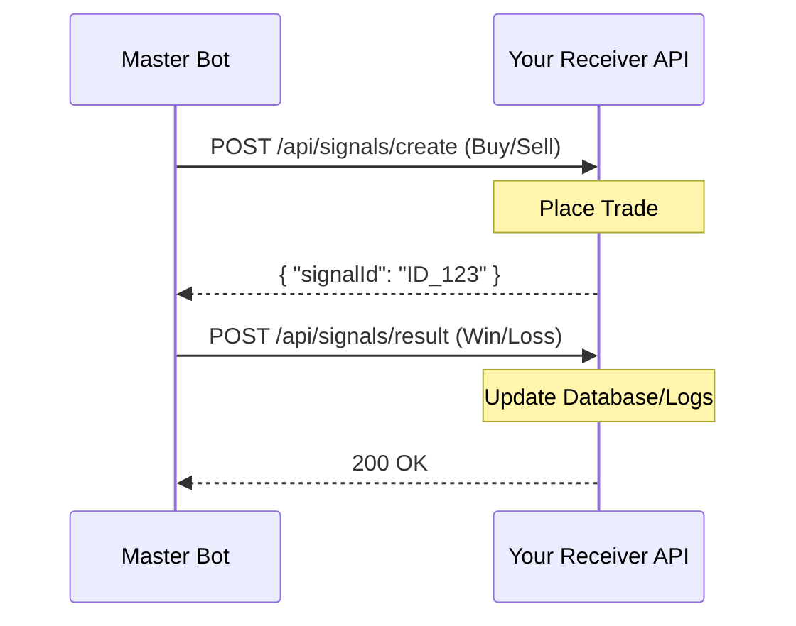

# Signal Receiver Integration Guide

This guide is for developers building a service (Receiver) that accepts trading signals from the **NielsAutoTrade Master Bot**.

---

## 1. Interaction Overview
The Master Bot sends HTTP POST requests to your server. There are two primary phases:
1. **Signal Creation**: A new trade signal is sent (Buy/Sell).
2. **Outcome Reporting**: The final result of that signal (Win/Loss) is sent later.



---

## 2. Authentication
Every request contains a security header to ensure only the Master Bot can trigger trades.
- **Header Key**: `X-Admin-Secret`
- **Recommended Value**: (Get this from the Master Bot's `.env` - default is `1234ea1`)

> [!WARNING]
> Your receiver MUST verify this header. If it is missing or incorrect, reject the request with a `401 Unauthorized` status.

---

## 3. API Endpoints

### A. Create Signal
**URL**: `POST /your-path/api/signals/create`

#### Request Payload
```json
{
  "ticker": "EURUSD", 
  "signal": "buy",
  "price": 1.0845,
  "time": 300 
}
```
- `ticker`: The asset name (Always Real market, no -OTC suffix).
- `signal`: `"buy"` (Call) or `"sell"` (Put).
- `price`: Current entry price (Float).
- `time`: Expiry duration in **seconds** (e.g., `60`, `180`, `300`).

#### Your Response (Required)
You MUST return a unique `signalId`. This ID is used later to tell you if the trade won or lost.
```json
{
  "status": "success",
  "signalId": "TX_992831" 
}
```

---

### B. Update Result
**URL**: `POST /your-path/api/signals/result`

#### Request Payload
```json
{
  "signalId": "TX_992831",
  "signal": "WIN"
}
```
- `signalId`: The same ID you provided in the `/create` step.
- `signal`: `"WIN"` or `"LOSS"`.

---

## 4. Best Practices for Error Prevention

### 1. Fast Response (Crucial)
Do not make the Master Bot wait for your trade to finish. 
- **Correct**: Receive signal -> Start trade in background -> Send `200 OK` + `signalId` immediately.
- **Incorrect**: Receive signal -> Wait for trade results -> Send response (This will cause timeouts).

### 2. Idempotency
Use the `signalId` (or a timestamp) to ensure you don't place the same trade twice if the network retries the request.

### 3. Header Validation
Always use the `X-Admin-Secret`. This prevents anyone else from sending fake signals to your API.

---

## 5. Implementation Example (Node.js)

```javascript
const express = require('express');
const app = express();
app.use(express.json());

const ADMIN_SECRET = "1234ea1";

app.post('/api/signals/create', (req, res) => {
    // 1. Authenticate
    if (req.headers['x-admin-secret'] !== ADMIN_SECRET) {
        return res.status(401).json({ error: "Unauthorized" });
    }

    const { ticker, signal, price, time } = req.body;
    console.log(`🚀 New Signal: ${signal} on ${ticker}`);

    // 2. Generate a unique ID
    const myId = `TRD_${Date.now()}`;

    // 3. Trigger your trade engine (DON'T 'await' it if it takes long)
    placeTrade(ticker, signal, price, time);

    // 4. Respond immediately
    res.json({
        status: "success",
        signalId: myId
    });
});

app.listen(3000, () => console.log("Receiver listening on 3000"));
```
